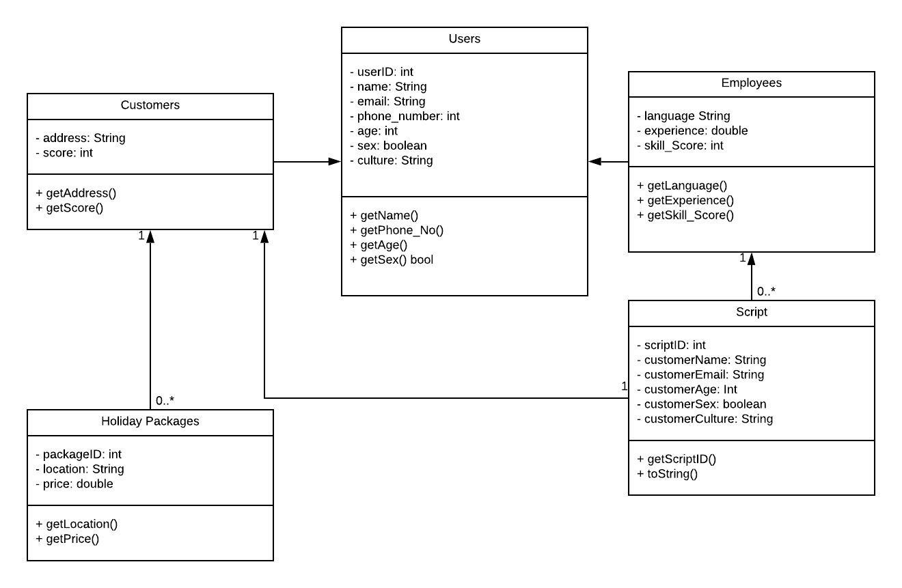

# 1 Objectives, List of Stakeholders and Problem Definition
---
## 1.1 Objectives

The objectives of this report will be to design a prototype to develop an information system for a major travel company “Travel X” and define the existing problems. This report will include a design thinking approach and an Agile Scrum methodology in order to develop this prototype. Identifying the stakeholders that are possible to clarify what kind of concerns they have. And through this project purpose, it can also define what kind of relationship is desirable. In addition, it is important to collaborate with stakeholders to provide better service for this project, so this project needs to ensure stakeholder needs and project needs.

For RUP models, the early stage of this project will use Use cases to design and analyse the prototype so that the basic structure of OO software can be built. As we use a waterfall model, there is only an opportunity to define requirements when the project starts. The Requests for this project can only be heard through requirements definition and basic design. Therefore, it takes a lot of time and effort when the specifications are changed during the project or after seeing the deliverables. Due to the number of man-hours required to redo, delivery of the final deliverable will be delayed so a use case basis builds iteration of the possible risks of large functions and important functions.

Thus, the following objectives of this report will be to:

- Identify stakeholders.
- Describe your approach from a Design Thinking principles perspective.
- Explain the agile methodology, namely, Scrum we have used to carry out the procedure.
- Describe our approach to four phases of Design Thinking principles to develop the Artefacts.
- List the assumptions we have made in the systems analysis.
- Document our proposed work products and models
- Argue competitive advantage
- consider the possible effects for this business as this information system project fails.

## 1.2 List of Stakeholders

Travel X has numerous stakeholders that need to be taken into consideration before any business process change is implemented. These cover the new and existing customers of the travel company and the Relationship Managers that are employed in the call centre. In addition to these stakeholders there are also upper management whom to which the RM’s currently report to, as well as the providers of the holiday packages which the RM’s sell to these customers. 

## 1.3 Problem Definition

The major travel company “Travel X” would like to develop their in-house call management center to provide improved call routing and dynamic call flow control for customers so they can improve customer satisfaction and sales. The system is also required to provide Relationship Managers (RM) with assistance when serving their end customers and match these RM’s with customers according to their skills and customer profiles. 

Currently, the Travel X’s operations have a layer of complexity based on the number and nature of various holiday packages that are offered. This creates further issues when the call routing system pairs a customer with a RM that is not fully trained in the product knowledge  of a certain holiday package.

From an outbound call perspective, it is to understand how to utilise the target list that is generated as a lead for the RM to call and then attempt to make a sale of the product from the conversation. Through Empathy mapping and understanding the RM’s pain points we were able to gauge that the system does not always provide an accurate suggestion of what a particular customer may want as a holiday package. The Empathy Maps also revealed that the inbound call system of customers with a higher score on the likelihood of repurchasing a package generated long wait times and led to the call abandonment rate to be unusually high. RM’s felt that during busier periods, customers that have been waiting for a longer time should be given attention chronologically, in a first-come-first-served order. This inturn would affect the ability of the RM in servicing unhappy customers who have experienced long wait times and could lead to complaints about the business process. 

Through an in depth analysis of the POV statements, the root of the pain points expressed relate directly to the system that generates customer leads for the RM, and the inbound system that ensures higher scoring customers are serviced first regardless of the call queue. 

The Travel X should continue to profile their RM’s and create a database of their employees who will then be further assessed on their customer service skills, product knowledge and their conversational ability. The firm would need to ensure the thorough training and vetting of each RM that they hire as the role has a high turnover rate, a result of the demanding and stressful day to day task the employee would be facing. Inexperienced bands have to teach newcomers, and the influx of new employees are not sufficiently trained, resulting in unsatisfactory customer service and a decrease in the competitive advantage of Travel X.

## 1.4 Design Thinking 
 
Design thinking to this project is implementing the 5 phases to ensure that undefined business problems and user needs. The Systematic approach is able to meet customer value and market opportunity.
When working in a team environment where we have client deliverables, in order to undertake Design Thinking methodologies and apply them to this use case we recommend to have daily debriefs to understand where the team stands in each iteration. Over the course of the iteration, the team needs to conduct daily standups that are time boxed. Each stand up only lasts about 15 minutes and should be held at the same time every day. We recommend it’s best to hold these towards the end of the day to recap what has been completed and what obstacles are remaining to overcome before the iteration is completed. By the end of 15 minutes, everybody will know what everybody else is working on and what blockers the team is facing. 
During the initial phases it is important to utilise stakeholder analysis and mapping. This can be done by making big visible charts or Kanban boards for the team to manage stakeholder needs and expectations. The usage of a 4 quadrant chart to map individual stakeholders or groups of stakeholders against their influence and impact. This will allow the team to visually represent whole portfolios, programs, releases, and iterations up on walls for the entire team to see. This would help with accountability and understanding what’s missing for completion of the tasks allocated.

## 1.5 Assumptions

1. RM inputs customer’s details (i.e name, postcode) into the existing ‘Profiler Tool’ at the beginning of their exchange.

2. ‘Profiler Tool’ determines cultural background based on the customer’s surname.

# 2 Design Thinking Approach With Artefacts
---
## 2.1 Assumptions

1. The ‘10 minutes questionnaire’ determines RM’s age, sex, culture, language proficiency, previous experience and product knowledge at the initial hiring.

2. The system will automatically update age of RM and customer, while sex and language proficiency is manually inputted upon request.

3. Data for outbound call’s ‘target list’ is retrieved from previous customers within CMC as well as data from third party companies that have access to a potential customer’s online search history.

4. A potential customer’s no. is added into the ‘target list’ after searching ‘holiday packages’ which CMC has to offer.

5. Once an outbound call ends, the system will give a 15 seconds second delay before redialing the subsequent no. on the ‘target list’.

6. During busy times, an inbound call’s ‘Interactive Voice Response’ prompts options;
- “Interested in one of our holiday packages?”
    - Prompts a list of countries and cities CMC offers
- “Cancel an existing holiday package?”
- “Asking a specific query”

7. System will determine which RM to route the customer to based on their selected prompt 

## 2.2 HMW STATEMENTS

We met a certain RM who couldn’t sell a holiday package to a customer. We were surprised to notice the RM did not possess the experience and enough knowledge on the named holiday destination and its traditions. We wonder if this means the current system does not include a RM and customer matching service. It would be game changing if the system could assign customers to their best matched RM.
		
	HMW: How might we improve call routing between RMs and customers.

We met a certain RM who had a long call duration with a customer. We were surprised to notice that the RM sale was not concise. We wonder if this means RMs are struggling to convey their thoughts. It would be game changing to provide RMs with catered scripts according to the customer’s desires.
	
	HMW: How might we increase efficiency of calls between RMs and customers.

Through an interview of an RM we uncovered that the current system of transferring an incoming call to the next available RM was not the course of action that brought the most value to the process. We considered allocating certain customers based on the type of holiday package they were interested in, to particular RM’s that are product specialists for those packages. This could allow for the highest value generation between RM and customer calls. 

	HMW: How might we gain the most value out of a customer & RM conversation that can then be converted in the sale of a holiday package. 

# 3 Workproducts, Models and Descriptions
---
## 3.2 Activity Diagrams

### Outbound Calls

### Inbound Calls

## 3.3 Class Diagram

## 3.4 Collaboration Diagram
![](images/

# 4 Competitive advantage Possible effects 
---
### 4.1 Competitive advantage that might be gained in developing the new information system 
CMC at this travel company is important role to stay competitive with their market. Both inbound and outbound calls are not just responding to customers, it is very important as a base for a business strategy where you communicate with many customers. RM is required as an indispensable role in improving the quality of telephone responses such as acquiring new customers, improving customer satisfaction, retaining customers, and marketing. In terms of reducing costs, the CMC must predict the number of inbound calls in order to improve the efficiency of inbound operations that receive calls, in order to prevent excess allocation of RMs and reduce personnel expenses. In addition, if accurate inbound forecasting is possible, it is possible to increase profits by preventing customer loss and losing opportunities. The quality of service from the customer's point of view is important to understand because it is directly related to customer satisfaction and corporate image. 
From the viewpoint of customer satisfaction, the response quality of RMs such as comprehension of call contents, manners of response, and accuracy of responses can be sought. Furthermore, from the viewpoint of corporate profit, it is required to accurately grasp changes in customer needs, intentions and circumstances in conversation and collect marketing information for contributing to the development of packages and services. To that end, it is important to regularly conduct staff training and be aware of trends. From the above, in order to improve the quality of the CMC, it is necessary to reduce the waiting time of the customer and responding appropriately by RMs with appropriate skills.  Predicting the number of inbound calls with high accuracy and improve the predicted RMs utilization rate, this travel company is possible to reduce costs and contribute to the quality seen from the operation side. That is the advantage to be competitive in terms of inbound calls.
From the point of view of outbound calls, it is important to understand and better understand the target in outbound, where the psychological distance from the customer is far.
Even if RMs try to convey the goodness of the package and service, customers will not be interested as it is not necessary for the customer. RMs require to understand that the product is valuable to the customer. Therefore, it is necessary to narrow down the target of what customers need package and services. In addition, by predicting lifestyle from the previous history in profile tool, it is possible to clarify the person's image according to the hobby of the customer so efficient outbound calls are possible by narrowing down the target based on clarifying customer image who needs the package service. 

### 4.2 Possible effects as the project fails 

As the proposed information system project fails, several implications can occur. One of the possible factors is the lack of proper call routines to RMs lead to long wait time. It can be poor customer satisfaction and lost customers. Another effect is the cost and time spent on the project will be wasted.
